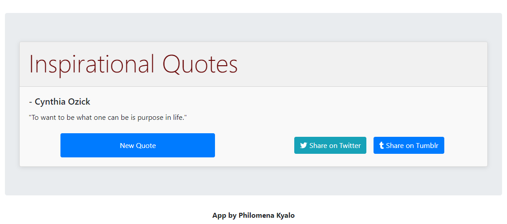

# Random Quote Machine

The Random Quote Machine is a web application that displays random inspirational quotes. It fetches quotes from the [Type.fit API](https://type.fit/api/quotes) and allows users to get a new quote and share quotes on social media platforms.

## Preview

This is just an overview of how the random quote machine works.

## Getting Started

To run the Random Quote Machine locally, follow these steps:

1. Clone the repository:

   git clone <repository_url>
   
2. Navigate to the project directory:

cd random-quote-machine

3. Install the dependencies:

npm install

4. Start the application:

npm start
The application should now be running at http://localhost:3000.

## Features

Displays a random quote from a collection of inspirational quotes.
It also allows users to get a new random quote.
Provides buttons to share quotes on Twitter and Tumblr.

You can add yours if you have any

## Technologies Used

React: A JavaScript library for building user interfaces.

Bootstrap: A popular CSS framework for styling web applications.

Font Awesome: A library of scalable vector icons.

## License

This project is licensed under the MIT License.
